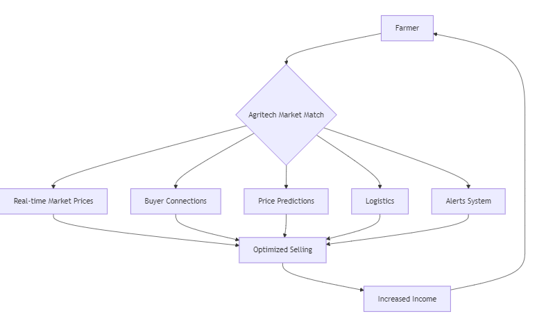
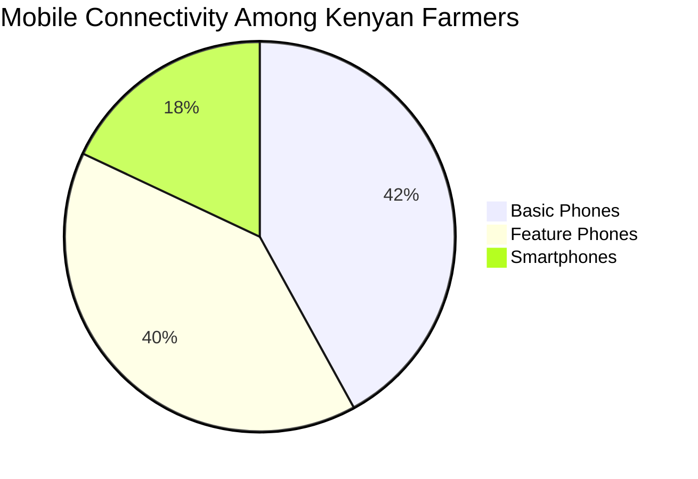
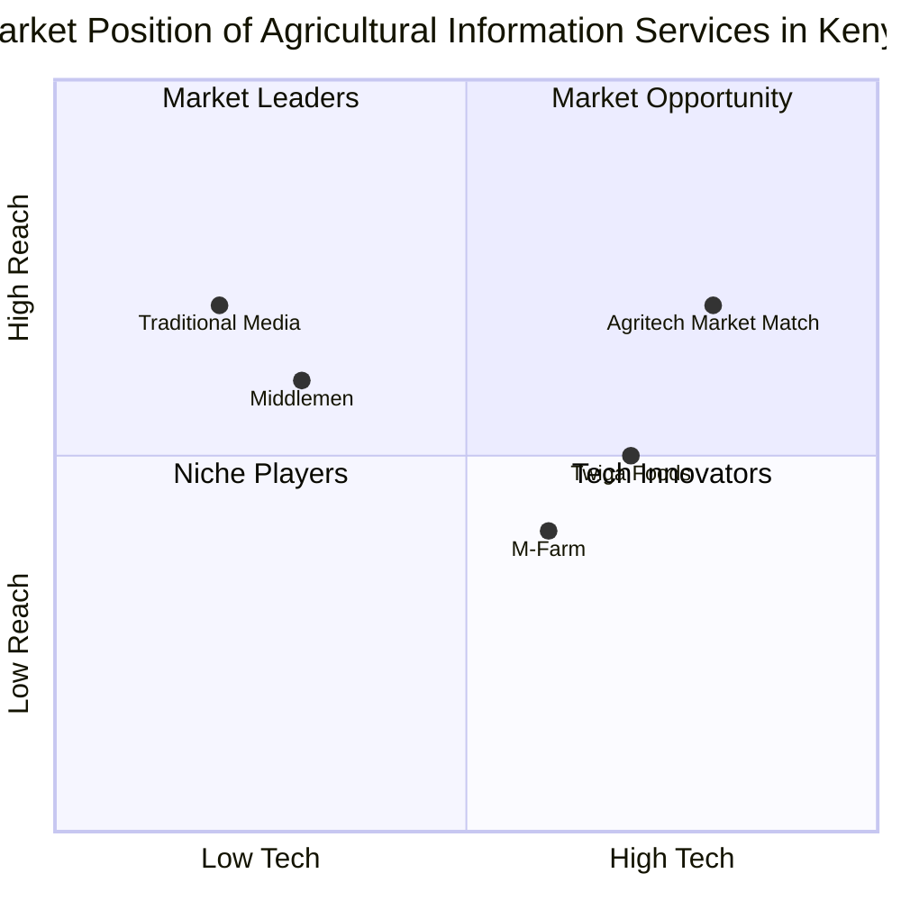
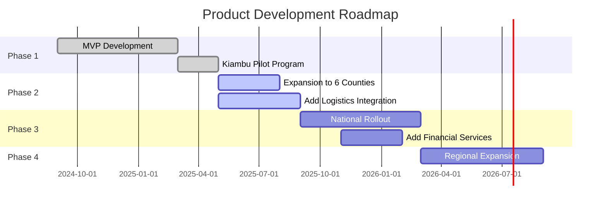
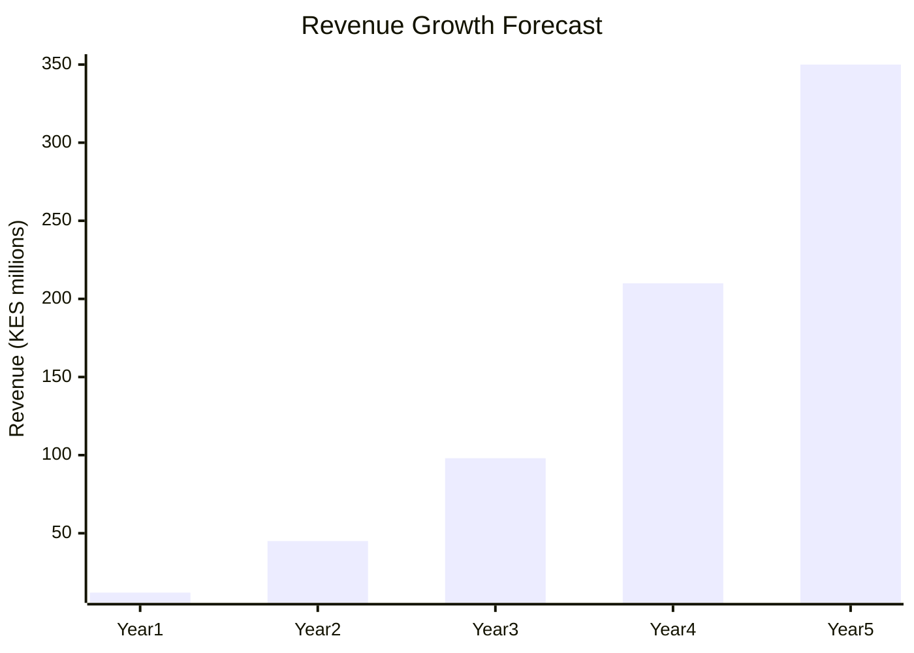
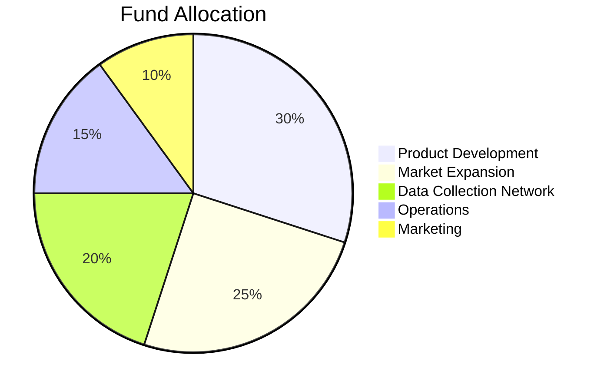

# Agritech Market Match

Empowering Kenyan Farmers with Real-Time Market Intelligence

  
    Press Space for next page <carbon:arrow-right class="inline"/>
  

  <a href="https://github.com/agritech-kenya" target="_blank" alt="GitHub" title="GitHub Repository"
    class="text-xl slidev-icon-btn opacity-50 !border-none !hover:text-white">
    <carbon-logo-github />
  </a>

<!--
Welcome to our pitch for Agritech Market Match, a solution dedicated to empowering Kenyan farmers with real-time market intelligence.
-->

# 1. The Problem

## Kenyan Farmers Face Critical Challenges

- Information asymmetry in agricultural markets
- Limited access to price data across different markets
- Price exploitation by intermediaries due to lack of transparency
- Post-harvest losses from inefficient market timing decisions
- Reduced bargaining power with buyers

### 40% of Kenya's produce spoils before reaching markets

<!--
Small-scale farmers in Kenya operate at a significant disadvantage due to lack of market information transparency. Many make decisions about when and where to sell their produce based on limited or outdated information, leading to exploitation and lost income opportunities.
-->

---

# 2. Our Solution

## Agritech Market Match Platform

An AI-driven mobile platform connecting farmers to:

- <carbon:catalog /> **Real-time market prices** across Kenya
- <carbon:user-profile /> **Direct buyer connections** eliminating middlemen
- <carbon:chart-multitype /> **Price trend predictions** for informed planning
- <carbon:delivery /> **Logistics coordination** with transportation partners
- <carbon:notification /> **SMS/WhatsApp alerts** for optimal selling opportunities

<!--
Our platform addresses these challenges through an AI-driven mobile solution that delivers market intelligence directly to farmers. By providing real-time price information and connecting farmers directly with buyers, we eliminate information gaps and empower farmers to make optimal selling decisions.
-->

---

# 3. The Product

## Key Features

- **Mobile-First Design**: USSD, SMS & App interfaces for all device types
- **Multilingual Support**: English, Swahili & local dialects
- **Offline Capabilities**: Vital features work without continuous internet
- **AI-Powered Analytics**: Price predictions & market trend analysis
- **Secure Direct Messaging**: Connect farmers with verified buyers

  

  

    
Agritech Market Match

    

      
Today's Tomato Prices

      
Nairobi Markets - May 25, 2025

      

        
Wakulima: KES 85/kg

        
↑ 5%

      

      

        
Gikomba: KES 78/kg

        
↓ 2%

      

      

        
Marikiti: KES 82/kg

        
↑ 3%

      

    

    

      
Buyer Alert

      
3 new buyers looking for tomatoes in your area

      <button class="bg-white text-green-700 rounded mt-2 w-full py-1 text-sm">View Buyers</button>
    

  

<!--
Our platform is designed with the Kenyan farmer in mind. We've built the service to work across various technology levels - from basic feature phones using USSD to smartphones with our app. The interface prioritizes simplicity and local relevance, with multilingual support and contextual market insights.
-->

---

# 4. Target Market

## Primary Users

- **5.4 million** smallholder farmers across Kenya
- 60% of Kenya's agricultural production comes from farms under 2 hectares
- Focus on producers of:
  - High-value perishables (tomatoes, vegetables, fruits)
  - Cash crops (coffee, tea, macadamia)
  - Staples (maize, beans, potatoes)

**Early Adoption Strategy**: Initial focus on 6 counties in Kenya's central and rift valley regions with highest smartphone penetration and agricultural activity.

## Secondary Users

  <h3 class="font-bold">Produce Buyers</h3>
  
Local markets, hotels, restaurants, supermarkets, exporters and distributors seeking consistent supply

  <h3 class="font-bold">Logistics Providers</h3>
  
Transportation companies offering services to move produce from farms to markets

  <h3 class="font-bold">Agricultural Organizations</h3>
  
Cooperatives, NGOs, and government extension services supporting farmers

<!--
We're targeting Kenya's massive smallholder farming community - the backbone of the country's agricultural sector. Our initial focus will be on farmers growing high-value perishable crops as they stand to gain the most immediate value from market timing intelligence. Our phased county-by-county rollout strategy ensures we can properly support users and iterate based on feedback.
-->

---

# 5. Market Size

  
$10B

  
Kenya's annual agricultural output

  
5.4M

  
Smallholder farmers across Kenya

  
65%

  
Of workforce employed in agriculture

## Serviceable Available Market (SAM)

- **2.7M farmers** with mobile phone access
- **$150M** annual potential revenue from subscriptions & service fees
- **420,000** farmers in initial target counties

<!--
Kenyan agriculture represents a massive market opportunity. The sector contributes about 33% of the country's GDP, with millions of smallholder farmers participating. Our platform addresses a critical information gap that currently costs these farmers billions in lost income opportunities. By providing market intelligence, we can capture value from a significant portion of the country's agricultural transactions.
-->

---

# 6. Competitors

  <h3 class="font-bold">Traditional Media</h3>
  <ul class="text-sm mt-2">
    <li>Radio price broadcasts</li>
    <li>Government bulletins</li>
    <li>Newspaper market reports</li>
  </ul>
  
Limitations: Outdated, generic information without personalization

  <h3 class="font-bold">Digital Platforms</h3>
  <ul class="text-sm mt-2">
    <li>M-Farm</li>
    <li>Twiga Foods</li>
    <li>Digital Green</li>
  </ul>
  
Limitations: Limited coverage areas, focus on specific crops, high barriers to entry

  <h3 class="font-bold">Middlemen Networks</h3>
  <ul class="text-sm mt-2">
    <li>Local brokers</li>
    <li>Aggregation centers</li>
    <li>Rural buying agents</li>
  </ul>
  
Limitations: Exploit information asymmetry, take excessive margins, unreliable

## Competitive Landscape Analysis

<!--
While there are existing solutions in the market, none holistically address the comprehensive needs of Kenyan farmers. Traditional media broadcasts prices but lacks personalization. Existing digital platforms have limited geographical coverage or focus on specific value chains. Our approach combines the best elements of these solutions while adding AI-driven insights and a more inclusive technology stack.
-->

---

# 7. Competitive Advantage

## Our Key Differentiators

- **Inclusive Technology Stack**: Multi-channel access (USSD, SMS, App) supporting all phone types
- **Hyper-Local Focus**: Granular price data at specific market level, not just regional averages
- **AI-Powered Predictions**: Machine learning algorithms predict optimal selling times
- **Full Market Network**: Connect all stakeholders - farmers, buyers, transporters, not just price information
- **Offline Functionality**: Critical features work without continuous connectivity

### Proprietary Market Data Collection

We've developed a network of on-the-ground data collectors, automated data scraping tools, and partnerships with key market operators to gather accurate, real-time price information.

### Innovative Business Model

Our tiered subscription approach makes basic services accessible to all farmers while premium features generate sustainable revenue from those who derive the most value.

<!--
Our competitive advantage stems from our deep understanding of the Kenyan agricultural context. We've designed a solution that works within existing technological constraints while delivering superior value. Our multi-channel approach ensures no farmer is left behind regardless of their technology access level, and our AI-driven insights provide value that no competitor currently offers.
-->

---

# 8. Traction & Roadmap

## Current Traction

- **MVP Developed**: Functional prototype with core features tested
- **Pilot Program**: 1,200 farmers in Kiambu County using beta version
- **Initial Partners**: 3 agricultural cooperatives and 5 large buyers onboarded
- **Data Collection**: Live market price tracking in 12 major markets

## User Feedback

"Before using this app, I would sometimes travel 30km to the market only to find prices much lower than expected. Now I know exactly when to harvest and where to sell for the best price." - Mary W., Tomato farmer, Kiambu

### Early Results

- 22% average increase in selling price for pilot users
- 30% reduction in post-harvest losses
- 85% user retention rate after 3 months

## Development Roadmap

<!--
We've already made significant progress in bringing our vision to reality. Our pilot in Kiambu County has demonstrated strong market fit, with farmers reporting substantial improvements in their selling prices. Our roadmap focuses on systematic expansion across Kenya's agricultural regions while continuously adding features that enhance the platform's value.
-->

---

# 9. Business Model

## Revenue Streams

- **Freemium Subscription Model**:
  - Basic: Free (limited market reports, SMS alerts)
  - Standard: KES 200/month (comprehensive market data)
  - Premium: KES 500/month (predictive insights, buyer matching)

- **Transaction Fees**: 2.5% commission on direct sales facilitated via platform

- **Data Monetization**: Aggregated market insights for agricultural businesses, government, and research

- **Advertising**: Targeted ads for agricultural inputs, services, and equipment

## Financial Projections (5-Year)

### Key Metrics

- **CAC**: KES 250 per farmer
- **LTV**: KES 9,000 (over 3 years)
- **Projected Break-even**: Month 28
- **Year 5 Profit Margin**: 35%

<!--
Our business model is designed to create value for all stakeholders while ensuring sustainable growth. We've structured our revenue streams to make essential services accessible to all farmers while monetizing premium features for those who can afford them. Our multi-stream approach reduces dependency on any single revenue source and creates a resilient business model.
-->

---

# 10. Go-to-Market Strategy

## Phased Rollout Approach

1. **Phase 1**: Target 6 counties with highest agricultural output
   - Partner with 20+ agricultural cooperatives
   - Establish presence at local markets

2. **Phase 2**: Expand to 15 additional counties
   - Partner with county governments
   - Leverage existing agri-extension networks

3. **Phase 3**: National coverage across all 47 counties
   - Strategic partnerships with telecom providers
   - Integration with government agricultural services

## Customer Acquisition Strategy

- **Field Activation**: Market day demonstrations and farmer field schools

- **Strategic Partnerships**: Agricultural cooperatives, input suppliers, extension services

- **Mobile Network Bundling**: Zero-rated data access through telecom partnerships

- **Radio Campaigns**: Targeted content on popular farming programs

- **Referral Program**: KES 100 credit for each successful referral

### Community Ambassador Program

Recruiting tech-savvy farmers as local ambassadors who earn commissions for onboarding and supporting other farmers in their communities. This creates employment while accelerating adoption.

<!--
Our go-to-market strategy recognizes the unique challenges of reaching rural farming communities. We'll combine digital and traditional outreach methods, leveraging trusted community networks and demonstrating clear value through in-person activations. Our phased approach ensures we can provide adequate support during the critical adoption phase.
-->

---

# 11. Our Ask

## Funding Requirements: $750,000

### Allocation of Funds

## Strategic Support Needed

### Beyond Capital

- **Network Access**: Introductions to agricultural cooperatives and large produce buyers

- **Technical Expertise**: Guidance on scaling mobile infrastructure in rural areas

- **Government Relations**: Support navigating regulatory environment for agtech

- **Industry Partnerships**: Connections to telecom providers for data access partnerships

### Investment Timeline

Seed round closing by July 2025 with first tranche release in August 2025 to fund Phase 2 expansion to 6 counties.

<!--
We're seeking $750,000 in seed funding to accelerate our growth across key agricultural regions in Kenya. Beyond capital, we're looking for strategic partners who can help us navigate the complex agricultural ecosystem and provide mentorship as we scale. The funds will primarily be used to enhance our technology, expand our data collection capabilities, and fuel our market expansion efforts.
-->

---

# 12. Our Team

  

    
  

  <h3 class="font-bold">Mwaniki Tifany</h3>
  
CEO & Co-founder

  
MSc in Agricultural Economics, 10+ years in agricultural extension services

  

    
  

  <h3 class="font-bold">Sarah Kiarie</h3>
  
Head of Data

  
Data scientist specializing in agricultural market intelligence

## Our Why

Our team combines deep agricultural expertise with technical innovation. We're driven by a shared mission to use technology to solve one of the most persistent challenges facing Kenyan farmers - market access and price transparency. We've experienced these challenges firsthand through our families and communities.

<!--
Our team brings together complementary expertise across agriculture, technology, and data science. Our founders have both professional experience and personal connections to the agricultural challenges we're addressing. This gives us unique insight into building solutions that work for our target users. Our advisory board provides strategic guidance and opens doors to key partnerships.
-->

---

layout: center
class: text-center
---

# Thank You

## Connecting Farmers to Markets, Knowledge to Action

  Contact: mwanikitiffany@gmail.com

  
Agritech Market Match © 2025

